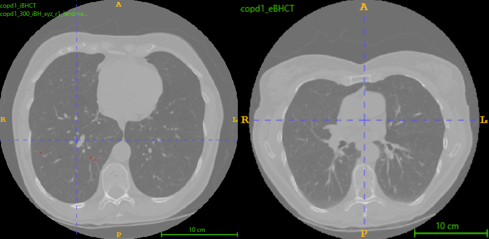
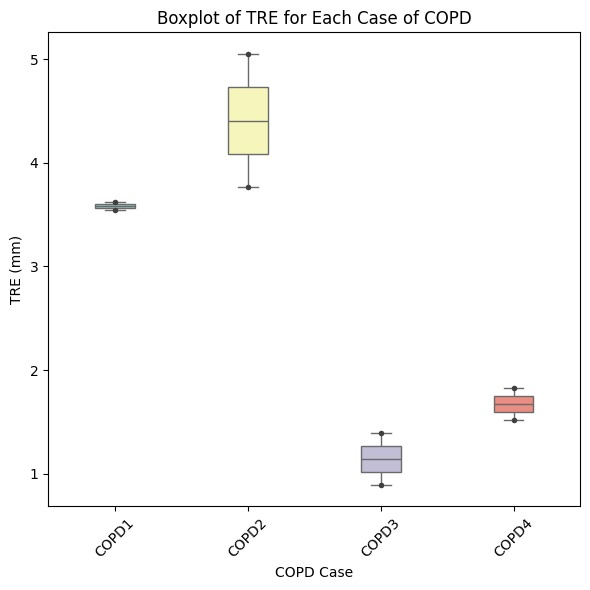
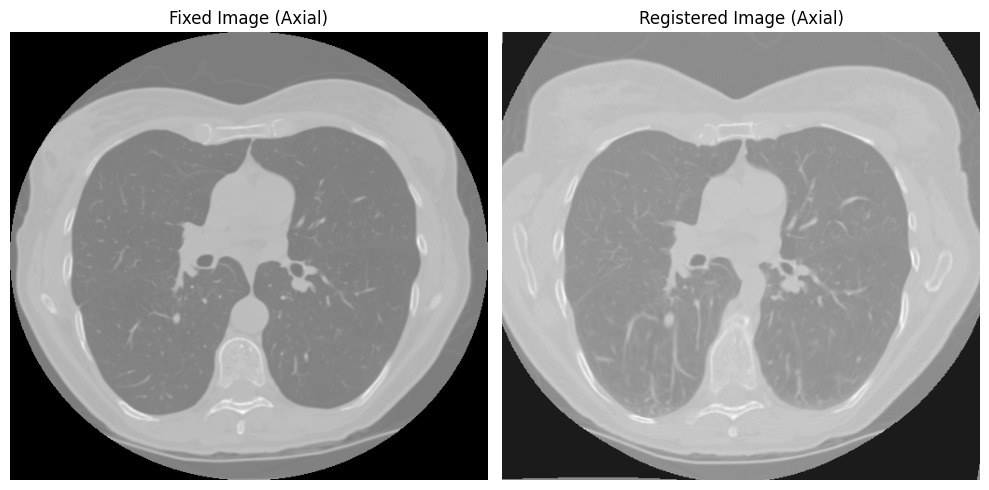

# 4D Chest CT Volume Registration: DIR-Lab Challenge

## Overview

This repository presents the implementation and analysis of image registration techniques for 4D chest CT volumes using the DIR-Lab challenge dataset. The project evaluates **traditional intensity-based methods** (ITK Elastix) and **deep learning-based methods** (VoxelMorph) for accurate alignment of thoracic images.

### Key Features
- Preprocessing steps, including **Normalization** and **CLAHE**, to enhance image quality.
- Traditional registration using **rigid and non-rigid transformations** with ITK Elastix.
- Deep learning-based deformable registration with **VoxelMorph**.
- Extensive analysis of **Target Registration Error (TRE)** across various configurations.
- Insightful comparisons of manual and automated segmentation approaches.

---

## Abstract

Image registration is crucial for aligning medical images into a common reference frame, enabling effective disease monitoring and treatment planning. This project:
- Achieves the **lowest TRE** of **2.63 ± 2.77 mm** using Elastix with mask-guided preprocessing.
- Highlights the **limitations of deep learning** for large respiratory deformations, as VoxelMorph records a TRE of **22.22 ± 8.21 mm**.
- Emphasizes the importance of **hybrid frameworks** to merge traditional methods' accuracy with deep learning's scalability.

---

## Dataset

The project uses the **COPDgene dataset**, provided by the National Heart, Lung, and Blood Institute, accessed from the [Deformable Image Registration Laboratory](https://www.dir-lab.com/). 

### Dataset Features:
- Four cases (COPD1–COPD4) with inhale and exhale CT volumes.
- Landmarks for ground truth evaluation.
- Image dimensions: 512 × 512 × varying slices.

### Example Visualization:


---

## Methodology

### Preprocessing
1. **Normalization**: Min-max normalization to standardize intensity values.
2. **CLAHE**: Improves local contrast for better visualization of lung structures.

### Registration Techniques
1. **Traditional Registration with ITK Elastix**
   - Affine + B-Spline transformations for rigid and non-rigid deformations.
   - Mask-guided registration for localized alignment.
2. **Deep Learning-Based Registration with VoxelMorph**
   - Trains a CNN to predict deformation fields directly.
   - Experiments include preprocessing and alignment strategies.

### Metrics
- **Target Registration Error (TRE)**: Measures alignment accuracy based on anatomical landmarks.

---

## Results & Discussion

### Highlights:
1. **Best Model**:
   - Configuration: **Elastix Par11 Affine + B-Spline with masks**.
   - Overall TRE: **2.63 ± 2.77 mm**.
2. **Deep Learning Challenges**:
   - VoxelMorph struggles with large deformations, recording a TRE of **22.22 ± 8.21 mm**.
3. **Computational Time**:
   - Traditional methods: Faster preprocessing and alignment.
   - Deep learning: Longer due to training and inference.

### Key Findings:
- Preprocessing steps significantly enhance registration accuracy.
- Hybrid approaches combining traditional and deep learning methods hold potential for future advancements.

---

## Visualizations

- TRE Box Plot:


- Registration Comparison:
  


---

## Installation and Usage

### Prerequisites
- Python 3.8+
- Libraries: TensorFlow, Keras, ITK, NumPy, Matplotlib, Scipy.

### Installation
1. Clone the repository:
   ```bash
   git clone https://github.com/<username>/4D-Chest-CT-Volume-Registration-DIR-Lab-Challenge.git
